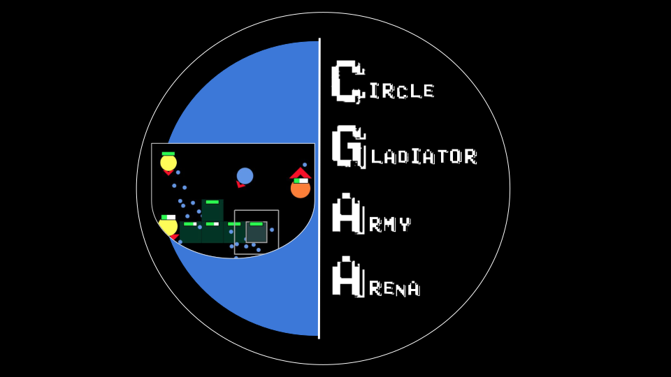
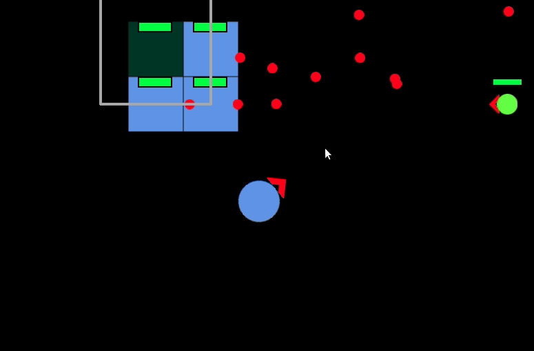

# Circle Gladiator Army Arena

A PhaserJS-based blend of 2D action and tower defense with charming programmer art.

## Play Version 0.1 here!

[CGAA](https://luccahellriegel.github.io/cgaa/page/game.html)

- Performance is only ok on Chromium-based Browsers (related to WebGL)
- Be prepared to reload because of bugs

### Learn to play!

- Tutorial (not everything in the prototype is self-explanatory sadly!): [Tutorial Page](https://luccahellriegel.github.io/cgaa/page/tutorial.html)
- Watch a playthrough (spoiler!):
  - [Playthrough Video by me](https://www.youtube.com/watch?v=Wgb_iVdO6x0&feature=youtu.be)
  - with glitches / Missing-King bug

## Game Webpage

[CGAA Webpage](https://luccahellriegel.github.io/cgaa/page)

- more information
- development documentation (mostly retrospective/opinions on first six months of development)
  - partially outdated / wrong as my views / practices have evolved by now
- tutorial
- trailer (only for humorous people ;) )

## Known Issues

- reload on loss / win necessary
- performance degradation after 10 minutes (so better finish the game before then ;))
- object pooling breaks down after 10 minutes too
- sometimes the king vanishes after too much time too (reload helps)
- visual glitches and weird UX are to be expected as this is a prototype and my very first from-scratch game

## Project History

- started dev in the context of a Game Design course at university (first six month)
- many experiments with program structure and style
- graphics are all created in-game
- now mainly used to explore interesting facets of Game Dev (but it should still be fun for a few rounds)

## Architecture

I strife for a layered architecture, where dependencies only go downward and the general execution order of the main functions is upwards.

The codebase reflects experiments with a multitude of possible approaches, but should be still understandable.

- 0_GameBase: constants, attempts at extracting general purpose engine code, misc
- 1_GameGraphics: creating all the in-game visuals / textures via code once the game loads
- 2_GameAnimation: composing the created textures into animations
- 3_GameData: creating all the per-round random but static data for the game layout
- 4_GameUnit: all the game unit classes and their components
- 5_GameState: setting up the dynamic game state (pathfinding structure, rivalries between camps)
- 6_GamePhysics: using all the modules below this to setup the correct physics group (hit collision, wall collision etc., sight detection)
- 7_GameUI: all the UI elements and interactions that the player can use (counters on the screen, tower-building menus etc.)
- 8_GameStart: finally using all the setup to populate the camps, start the Tower Defense waves, enable-player input

The game is spread over the Gameplay scene and the HUD scene, which is an overlay for the Gameplay scene for displaying UI elements and interactions etc.

## Credit

[Anastasiia Buianova](https://github.com/AnastasiaBuianova) for:

- collaborating on the trailer concept / text / audio
- animating / painting the whole trailer from scratch / video cut
- key ideas for the color schema of the game and overall UI design
- constant encouragement

## License

MIT. See [LICENSE](./LICENSE) file.
