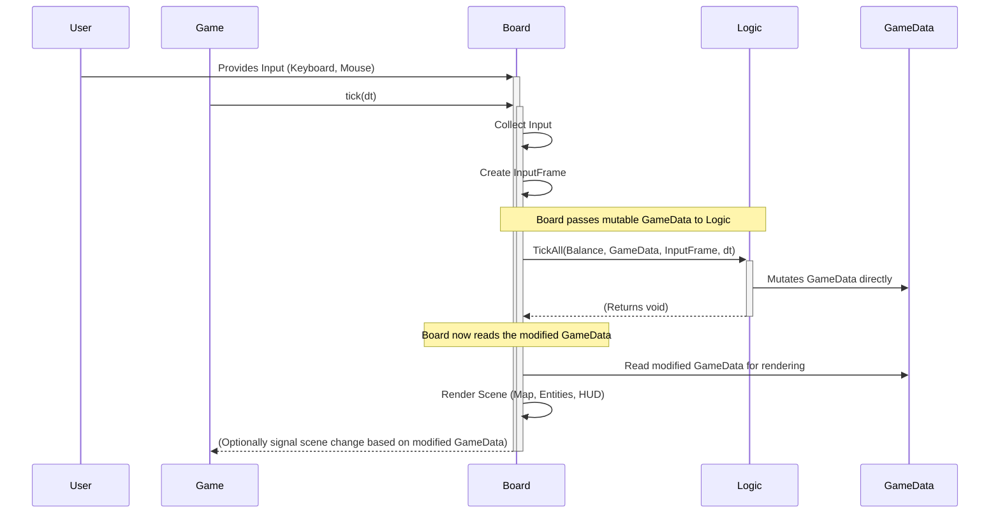

# Circle Gladiator Army Arena (CGAA) - MVP PRD

## Purpose

This Product Requirements Document (PRD) defines the scope, features, and technical specifications for the Minimum Viable Product (MVP) of Circle Gladiator Army Arena (CGAA). The purpose of this MVP is to deliver a playable 2D Action Tower Defense game experience incorporating the core mechanics outlined in the project brief: player control, wave survival, resource management (souls), tower building/selling (Shooter & Healer), camp interaction (conquest & diplomacy), and a final boss encounter (the King), built upon a **performance-focused Data-Oriented Design architecture using mutable state**.

This document serves as the source of truth for the development team (junior developers and AI agents) and the architect, guiding incremental development, ensuring alignment, and defining the criteria for a successful MVP launch. It aims to minimize ambiguity and provide clear, actionable requirements suitable for the chosen architecture.

## Context

CGAA is envisioned as a fast-paced, engaging 2D game combining direct action combat with strategic tower defense elements. The player controls a circle character, defending stationary "blue friends" against waves of enemies spawning from camps within a randomly generated arena. Players gather souls from defeated enemies to build defensive towers. Camps can be conquered through force or turned into allies via diplomacy and quests. The ultimate goal is to defeat the King, who appears after all camps are neutralized.

The target platform is the web, utilizing the HTML Canvas API directly via TypeScript. The MVP focuses on realizing the complete core gameplay loop described above, implemented using a Data-Oriented Design pattern **where logic functions directly mutate a pre-allocated GameData structure** for optimal performance.

## High-Level Architecture

The application will follow a **Data-Oriented Design (DOD)** pattern, emphasizing the separation of data (state) and logic (behavior). State updates will be performed **mutably** by logic functions operating directly on the game state data structure for performance.

**Core Components:**

1.  **Balance:** Contains immutable, design-time configuration data (stats, costs, waves, camp templates, quest details, King stats, input map, etc.). Loaded once at application start, likely from JSON files. Remains read-only during gameplay.
2.  **GameData:** Holds the complete **mutable** state of the current game session (player info, entity arrays for towers/enemies/projectiles, camp states, quest states, timers, UI flags, King HP, etc.). This structure should be designed for efficient access and mutation, potentially using pre-allocated arrays where possible. **Logic functions directly modify this object.**
3.  **Logic:** A collection of **static functions** responsible for all game rule calculations and state transitions. Takes `Balance`, the **mutable** `GameData` object, user `InputFrame`, and delta time (`dt`) as input. **These functions directly modify the properties of the passed-in `GameData` object.** They typically do not return anything (or return `void`).
4.  **Board:** The main gameplay scene handler. It:
    - Collects raw user input (keyboard/mouse).
    - Packages input into an `InputFrame`.
    - Calls the main `Logic` function(s) (e.g., `Logic.TickAll`) passing the current `GameData` object (along with `Balance`, `InputFrame`, `dt`). **`Logic` modifies this `GameData` object in place.**
    - Renders the (now potentially modified) `GameData` (map, entities, HUD) to the Canvas via dedicated rendering functions.
    - Detects game-over or victory conditions by reading the modified `GameData` to signal scene changes to `Game`.
5.  **Game:** The top-level application controller. Manages:
    - Loading `Balance` data.
    - Initializing and **allocating** the main `GameData` structure.
    - Switching between application scenes (e.g., Main Menu (future), Board, Victory/Defeat Screen).
    - The main game loop (`requestAnimationFrame`), passing `dt` down.
    - Handling global states like pause (future).

**Data Flow (Single Gameplay Frame):**



## Story (Task) List

_Stories are ordered to build foundational components first. Logic function descriptions now reflect mutation._

---

### Epic 1: Core Setup & Data Structures

**Goal:** Establish the project structure, core components (`Game`, `Board`), data structures (`Balance`, `GameData`), and the main loop.

**Story 0: Initial Project Setup**

- Set up Git repository.
- Initialize TypeScript project using Vite (`vanilla-ts` template).
- Install base dependencies (Vitest, Prettier, ESLint).
- Configure Vite, Prettier, ESLint.
- Set up basic `index.html` with a Canvas element.

**Story 1: Implement `Game` Component & Loop**

- Create `Game` class (`src/game.ts`).
- Implement main game loop using `requestAnimationFrame`, calculating delta time (`dt`).
- Implement basic scene management logic (initially just starts the `Board`).
- Instantiate and run `Game` in `main.ts`.

**Story 2: Define `Balance` Data Structure & Loading**

- Create `Balance` type/interface (`src/balance.ts`).
- Define initial fields: Tower costs/types, player base stats, tower limit.
- Implement function to load `Balance` data (initially hardcoded, later from JSON).
- `Game` component loads `Balance` on initialization.

**Story 3: Define & Allocate `GameData` Structure**

- Create `GameData` type/interface (`src/gamedata.ts`).
- Define fields: `player: PlayerState`, `towers: Tower[]`, `enemies: Enemy[]`, `projectiles: Projectile[]`, `friends: Friend[]`, `camps: CampState[]`, `grid: GridData`, `gameStatus: 'playing' | 'won' | 'lost'`, etc. Use concrete types/interfaces for states.
- Define types for `PlayerState`, `Tower`, `Enemy`, etc.
- `Game` component **allocates and initializes** the `GameData` object, potentially pre-allocating arrays to a reasonable maximum size if optimizing early.

**Story 4: Implement Basic `Board` Component**

- Create `Board` class (`src/board.ts`).
- `Board` receives `Balance` and `GameData` reference from `Game`.
- Implement `Board.tick(dt)` method called by `Game`.
- Implement basic rendering setup (get Canvas context).

**Story 5: Implement `InputFrame` and Basic Input Collection**

- Define `InputFrame` type (`src/core/types.ts` or `input.ts`): `{ keysDown: Set<string>, mousePos: {x, y}, leftClick: boolean, fKeyToggled: boolean }`.
- Implement input listeners (`src/core/input.ts`) for keyboard (`keydown`, `keyup`) and mouse (`mousemove`, `mousedown`, `mouseup`).
- `Board` collects raw input and creates the `InputFrame` at the start of its `tick`.

**Story 6: Implement Basic `Logic.TickAll` Structure**

- Create `Logic` module entry point (`src/logic/index.ts`).
- Define `TickAll(Balance, GameData, InputFrame, dt): void` function signature.
- Initially, `TickAll` does nothing to the input `GameData`.
- `Board.tick` calls `Logic.TickAll`, passing its `GameData` reference.

---

### Epic 2: Rendering & Basic Player Movement

**Goal:** Render the basic world and player, implement player movement logic (mutating `GameData`).

**Story 7: Implement Arena Generation & Grid Data**

- Define `GridData` structure within `GameData` (e.g., `width: 50, height: 50, walls: boolean[][]`).
- Implement logic (potentially in a separate utility or initial setup function called by `Game`) to generate the random 50x50 arena walls and store in the initial `GameData.grid`.
- Ensure path connectivity.

**Story 8: Implement World Rendering**

- Create rendering functions (`src/rendering/drawWorld.ts`).
- Implement `drawArena(ctx, gridData)` to draw the black floor and gray walls based on `GameData.grid`.
- `Board.render()` calls `drawArena`.

**Story 9: Implement Player Rendering**

- Create rendering functions (`src/rendering/drawEntities.ts`).
- Implement `drawPlayer(ctx, playerState)` to draw the light blue circle based on `GameData.player`.
- `Board.render()` calls `drawPlayer`.

**Story 10: Implement `Logic.UpdatePlayerPosition`**

- Create `src/logic/player.ts`.
- Implement function `UpdatePlayerPosition(Balance, GameData, InputFrame, dt): void` that:
  - Reads `WASD` from `InputFrame.keysDown`.
  - Calculates new potential position based on `GameData.player.position`, `Balance.player.speed`, and `dt`.
  - Checks for collisions with walls (`GameData.grid.walls`).
  - **Directly modifies** `GameData.player.x` and `GameData.player.y` if movement is valid.
- Integrate `UpdatePlayerPosition` call into `Logic.TickAll`.

**Story 11: Implement Player Health Bar Rendering**

- Implement `drawHealthBar(ctx, x, y, currentHp, maxHp)` in `src/rendering/drawUtils.ts` (or similar).
- `drawPlayer` calls `drawHealthBar` using `GameData.player.hp` and `Balance.player.maxHp`.

**Story 12: Implement Player Mode Switching Logic & Indicator**

- Implement `Logic.TogglePlayerMode(Balance, GameData, InputFrame): void` in `src/logic/player.ts`.
  - Checks `InputFrame.fKeyToggled`.
  - **Directly modifies** `GameData.player.mode` by flipping its value ('attack'/'interact').
- Integrate into `Logic.TickAll`.
- `drawPlayer` adds a visual indicator based on the current `GameData.player.mode`.

---

### Epic 3: Enemies, Waves & Pathfinding

**Goal:** Implement enemy data, spawning, basic movement (mutating `GameData`), and rendering.

**Story 13: Define Enemy & Friend Data**

- Define `Enemy` type in `gamedata.ts` (`id`, `type`, `x`, `y`, `hp`, `targetId`, `path: Vec2[]`).
- Define `Friend` type (`id`, `x`, `y`, `hp`, `isFleeing`).
- Add `Enemy` stats (Small, Medium, Large HP/Damage/Speed/Souls) and `Friend` stats (HP/Speed) to `Balance`.
- Add `friends: Friend[]` array to `GameData`.
- Implement logic (in `Game` setup) to place initial `BlueFriends` in `GameData`.

**Story 14: Implement Friend Rendering**

- Implement `drawFriend(ctx, friendState)` in `drawEntities.ts` (dark green square). Include health bar.
- `Board.render()` iterates `GameData.friends` and calls `drawFriend`.
- Implement Friend counter UI (`drawUI.ts`, reads `GameData.friends.length`).

**Story 15: Implement Pathfinding Setup (A\*)**

- Integrate or implement A\* algorithm (`src/core/pathfinding.ts`).
- Function `findPath(gridData, startPos, endPos): Vec2[]`.
- A\* should read obstacle data from `GameData.grid` (and later, towers/camps).

**Story 16: Implement Basic Enemy Spawning & Wave Logic**

- Define wave schedule/structure in `Balance` (e.g., `[{ time: 10, campIndex: 0, enemies: ['small', 'small', 'small'] }, ...]`).
- Add `waveTimer`, `currentWaveIndex` to `GameData`.
- Implement `Logic.SpawnWaves(Balance, GameData, dt): void` (`src/logic/enemy.ts`):
  - Updates `GameData.waveTimer`.
  - Checks schedule in `Balance`.
  - When a wave triggers, **creates and pushes** new `Enemy` objects into the `GameData.enemies` array. Assigns initial target and calculates initial path.
- Integrate into `Logic.TickAll`.

**Story 17: Implement Enemy Movement Logic**

- Implement `Logic.UpdateEnemyPositions(Balance, GameData, dt): void` (`src/logic/enemy.ts`):
  - Iterates through `GameData.enemies`.
  - For each enemy, calculates new position along its path.
  - **Directly modifies** the `x`, `y` properties of the enemy object within the `GameData.enemies` array.
  - Handles path updates.
- Integrate into `Logic.TickAll`.

**Story 18: Implement Enemy Rendering**

- Implement `drawEnemy(ctx, enemyState)` in `drawEntities.ts` (yellow/red shapes, distinct per type). Include health bar.
- `Board.render()` iterates `GameData.enemies` and calls `drawEnemy`.

---

### Epic 4: Combat Basics & Resources

**Goal:** Implement player attack, damage application, enemy death, and soul management (mutating `GameData`).

**Story 19: Implement Player Attack Logic (Attack Mode)**

- Add `playerAttackCooldown` to `GameData`.
- Define player weapon stats (damage, cooldown, range) in `Balance`.
- Implement `Logic.HandlePlayerAttack(Balance, GameData, InputFrame, dt): void` (`src/logic/combat.ts`):
  - Checks mode, input, cooldown.
  - If attacking:
    - Determine hit enemies.
    - **Directly modify** target enemy HP (or add to a temporary damage list within `GameData` if processing damage separately).
    - **Modify** `GameData.playerAttackCooldown`.
    - Potentially **push** a `Projectile` to `GameData.projectiles`.
- Integrate into `Logic.TickAll`. Update `playerAttackCooldown` timer logic.

**Story 20: Implement Projectile Logic & Rendering**

- Define `Projectile` type in `gamedata.ts` (`id`, `x`, `y`, `targetId`, `speed`, `damage`, `type: 'player' | 'tower'`).
- Implement `Logic.UpdateProjectiles(Balance, GameData, dt): void` (`src/logic/combat.ts`):
  - Moves projectiles. **Modifies** their `x`, `y`.
  - Checks for collision. On hit, **modify** target HP and **remove** projectile from `GameData.projectiles` (e.g., using splice or filter/replace).
- Integrate into `Logic.TickAll`.
- Implement `drawProjectile(ctx, projectileState)` in `drawEntities.ts`.
- `Board.render()` iterates `GameData.projectiles`.

**Story 21: Implement Damage Application & Enemy Death**

- Implement `Logic.ApplyDamage(Balance, GameData): void` (`src/logic/combat.ts`):
  - (If using a damage list) Processes damage events, **modifying** HP for player, friends, enemies, towers directly in `GameData`. Clears damage list.
- Implement `Logic.HandleDeaths(Balance, GameData): void` (`src/logic/combat.ts`):
  - Checks entities HP in `GameData`.
  - **Removes** dead entities from their respective arrays in `GameData`.
  - Triggers soul awards for dead enemies (calls `AwardSouls`).
- Integrate into `Logic.TickAll` (order matters: attacks -> projectiles -> damage -> deaths).

**Story 22: Implement Soul Management Logic & UI**

- Implement `Logic.AwardSouls(Balance, GameData, enemyType): void` (`src/logic/combat.ts` or `player.ts`):
  - Reads soul reward from `Balance`.
  - **Directly modifies** `GameData.player.souls`.
- Implement UI display for `GameData.player.souls` (bottom right) in `drawUI.ts`.

**Story 23: Implement Enemy Attack Logic**

- Implement `Logic.HandleEnemyAttacks(Balance, GameData, dt): void` (`src/logic/enemy.ts` or `combat.ts`):
  - Enemies check if adjacent to their target (`Player` or `Friend`).
  - If attacking, **modify** target's HP and enemy's attack cooldown in `GameData`.
- Integrate into `Logic.TickAll`.

**Story 24: Implement Friend Fleeing Logic**

- Implement `Logic.UpdateFriends(Balance, GameData, dt): void` (`src/logic/friend.ts`?):
  - Check if friend took damage. If yes, **modify** `isFleeing` flag and a flee timer in `GameData.friends[]`.
  - If `isFleeing`, **modify** friend's `x`, `y`.
  - Decrement flee timer. When timer <= 0, clear `isFleeing`.
- Integrate into `Logic.TickAll`.

---

### Epic 5: Tower Mechanics

**Goal:** Implement building, selling, and functionality for towers (mutating `GameData`).

**Story 25: Define Tower Data & Build Menu UI**

- Define `Tower` type in `gamedata.ts` (`id`, `type: 'shooter' | 'healer'`, `x`, `y`, `hp`, `cooldown`, `targetId`).
- Add Tower stats (Shooter/Healer HP, Damage/Heal Amount, Range, Speed) to `Balance`.
- Implement Build Menu UI (`drawUI.ts`, top right): Show icons for Shooter/Healer, display costs from `Balance`. Handle clicks to set a `buildMode` flag in `GameData`? (Or handle directly in `Board` interaction).

**Story 26: Implement Tower Placement Preview & Logic**

- `Board` interaction handles preview.
- Implement `Logic.BuildTower(Balance, GameData, InputFrame): void` (`src/logic/tower.ts`):
  - Checks validity, souls, limits.
  - If valid:
    - **Modify** `GameData.player.souls`.
    - **Push** new `Tower` object to `GameData.towers`.
    - **Modify** `GameData.grid` obstacle data.
- Integrate into `Logic.TickAll`.

**Story 27: Implement Shooter Tower Attack Logic**

- Implement `Logic.UpdateShooterTowers(Balance, GameData, dt): void` (`src/logic/tower.ts`):
  - Iterate `GameData.towers` of type 'shooter'.
  - Find nearest enemy within range (`Balance` stats).
  - If target found and cooldown ready, **push** projectile to `GameData.projectiles`, **modify** tower's cooldown timer in `GameData.towers[]`.
- Integrate into `Logic.TickAll`.

**Story 28: Implement Healer Tower Logic**

- Implement `Logic.UpdateHealerTowers(Balance, GameData, dt): void` (`src/logic/tower.ts`):
  - Iterate `GameData.towers` of type 'healer'.
  - Find most damaged friendly (Player or Tower) within range.
  - If target found and cooldown ready, **modify** target's HP (Player or Tower in `GameData`), **modify** healer tower's cooldown.
- Integrate into `Logic.TickAll`.

**Story 29: Implement Tower Rendering & Health Bars**

- Implement `drawTower(ctx, towerState)` in `drawEntities.ts` (distinct green circles). Include health bar.
- `Board.render()` iterates `GameData.towers`.

**Story 30: Implement Tower Selling Logic**

- `Board` interaction: If in 'interact' mode, detect right-click (or other mechanism) on a tower.
- Implement `Logic.SellTower(Balance, GameData, InputFrame, targetTowerId): void` (`src/logic/tower.ts`):
  - Checks validity.
  - If valid:
    - **Modify** `GameData.player.souls`.
    - **Remove** tower from `GameData.towers`.
    - **Modify** `GameData.grid` obstacle data.
- Integrate into `Logic.TickAll` (triggered by input).

---

### Epic 6: Camp Systems & Conquest

**Goal:** Implement camps, wave spawning, and destruction (mutating `GameData`).

**Story 31: Define Camp Data Structures**

- Define `CampState` in `gamedata.ts` (`id`, `status: 'active' | 'conquered' | 'allied'`, `position`, `buildings: CampBuilding[]`, `guards: Enemy[]`, `diplomat: DiplomatState`, `nextWaveTargetCampId`).
- Define `CampBuilding` (`id`, `type`, `hp`, `positionOffset`).
- Define `DiplomatState` (`id`, `positionOffset`, `activeQuest: Quest | null`).
- Define `Quest` (`targetCampId`, `reward: 'ally'`).
- Add Camp templates (building/guard layouts) and number of camps (3-6) to `Balance`.
- Update initial `GameData` setup to place camps randomly based on `Balance`.

**Story 32: Implement Camp Rendering**

- Implement `drawCamp(ctx, campState)` in `drawEntities.ts`. Draw buildings, guards (using `drawEnemy`), diplomat (unique shape), status markers ('X', 'C'). Include health bars for buildings.
- `Board.render()` iterates `GameData.camps`.

**Story 33: Link Wave Spawning to Camps**

- Modify `Logic.SpawnWaves`:
  - Read wave schedule from `Balance`.
  - Select active camp (`GameData.camps`) based on schedule or round-robin.
  - Spawn enemies at the camp's designated spawn building position.
  - Draw white arrow indicator (`drawUI.ts`) from spawning camp towards player/friends area.

**Story 34: Implement Attacking Camps**

- Modify `Logic.HandlePlayerAttack`, `Logic.UpdateProjectiles`, `Logic.ApplyDamage`: Allow targeting and damaging `CampBuilding` entities (**modify** HP in `GameData.camps[].buildings[]`).
- Modify `Logic.HandleDeaths`: Handle building destruction (**remove** from `buildings` array).

**Story 35: Implement Camp Conquest Logic**

- Implement `Logic.UpdateCampStatus(Balance, GameData): void` (`src/logic/camp.ts`):
  - Iterate `GameData.camps`.
  - If a camp has status 'active' and all its buildings and guards are destroyed:
    - **Modify** its `status` to 'conquered' within `GameData.camps[]`.
    - Stop waves originating from this camp (check status in `SpawnWaves`).
- Integrate into `Logic.TickAll`.

---

### Epic 7: Diplomacy & Alliance

**Goal:** Implement quests and alliances (mutating `GameData`).

**Story 36: Implement Diplomat Interaction & Quest Offering**

- `Board` interaction: In 'interact' mode, detect click on a Diplomat entity within a camp.
- Implement `Logic.InteractDiplomat(Balance, GameData, InputFrame, targetDiplomatId): void` (`src/logic/diplomacy.ts`):
  - Find the corresponding camp.
  - If camp is 'active' and has no `activeQuest`:
    - Generate a quest (select another 'active' camp as target based on `Balance` rules/tables).
    - **Modify** `diplomat.activeQuest` within the relevant `GameData.camps[]` object.
  - Display quest info UI (`drawUI.ts`) based on `activeQuest`.
- Integrate into `Logic.TickAll` (triggered by input).

**Story 37: Implement Quest Completion & Alliance Logic**

- Modify `Logic.UpdateCampStatus`:
  - When a camp becomes 'conquered', check if it was the `targetCampId` of any _other_ camp's `activeQuest`.
  - If yes, find the quest-giving camp and **modify** its `status` to 'allied' and clear its `activeQuest` within `GameData.camps[]`.

**Story 38: Implement Allied Camp Wave Direction**

- `Board` interaction: In 'interact' mode, detect click on an 'allied' camp marker or diplomat. Show UI (`drawUI.ts`) to select a target ('active' enemy camp).
- Implement `Logic.SetAlliedTarget(Balance, GameData, InputFrame, alliedCampId, targetCampId): void` (`src/logic/diplomacy.ts`):
  - **Modify** `nextWaveTargetCampId` for the allied camp in `GameData.camps[]`.
- Modify `Logic.SpawnWaves`:
  - If an 'allied' camp is scheduled to spawn a wave:
    - Spawn allied units (defined in `Balance`?).
    - Set their target to the `nextWaveTargetCampId`.
    - Calculate path towards that camp.
  - Draw colored arrow indicator (`drawUI.ts`) from allied camp to its target.

---

### Epic 8: Game Flow & King Boss

**Goal:** Implement win/loss conditions and the final King boss encounter (mutating `GameData`).

**Story 39: Implement Win/Loss Condition Logic**

- Implement `Logic.CheckGameEnd(Balance, GameData): void` (`src/logic/gameflow.ts`):
  - Check player HP, friend count, camp statuses, king HP.
  - **Modify** `GameData.gameStatus` accordingly.
- Integrate into `Logic.TickAll`.

**Story 40: Implement King Boss Data & Spawning**

- Define `King` type/state in `gamedata.ts` (`hp`, `x`, `y`, `state`, `attackCooldown`, etc.). Add `king: KingState | null` to `GameData`.
- Add King stats (HP, damage, speed, attack patterns) to `Balance`.
- Modify `Logic.TickAll` or add `Logic.SpawnKing`: When triggered by `CheckGameEnd`, **create and assign** the King object to `GameData.king`.

**Story 41: Implement King Boss Logic**

- Implement `Logic.UpdateKing(Balance, GameData, dt): void` (`src/logic/king.ts`):
  - **Modify** `GameData.king.x`, `GameData.king.y`.
  - Handle attacks, **modifying** target HP and King's cooldowns in `GameData`.
- Integrate into `Logic.TickAll` (only run if King exists).

**Story 42: Implement King Rendering**

- Implement `drawKing(ctx, kingState)` in `drawEntities.ts`. Include health bar.
- `Board.render()` calls `drawKing` if King exists in `GameData`.

**Story 43: Implement Game Over / Victory Screens**

- `Game` component checks `Board`'s current `GameData.gameStatus`.
- If 'won' or 'lost', switch from `Board` scene to a simple Win/Loss screen component/function that displays the message.

---

### Epic 9: Polish & Configuration

**Goal:** Refine UI/UX, load all balance data from JSON, add visual feedback.

**Story 44: Load All Balance Data from JSON**

- Create JSON files in `src/config/` for all `Balance` data (towers, enemies, waves, camps, player, king, etc.).
- Update `Balance` loading logic (`src/balance.ts`) to fetch and parse these JSON files asynchronously at game start.

**Story 45: Consolidate and Refine UI**

- Ensure all UI elements are present, positioned correctly, and clear:
  - Health bars (consistent style).
  - Counters (Souls, Friends, Towers).
  - Build Menu (clear selection state).
  - Mode Indicator.
  - Placement Preview (clear valid/invalid states).
  - Camp/Wave Indicators (arrows, X, C).
  - Quest Text.
  - Win/Loss Messages.

**Story 46: Add Visual Polish & Feedback**

- Implement simple animations/effects in rendering functions:
  - Player attack visual.
  - Tower projectile visuals.
  - Healer effect visual.
  - Damage flash effect on entities.
  - Death effect (fade out, particles).
  - Build/Sell effect.

---

## Testing Strategy

- **Unit Tests (Vitest):**
  - **Primary Focus:** Test individual `Logic` functions. Testing functions that mutate state requires careful setup and teardown. For each test case:
    1.  Create a known initial `GameData` state (deep copy if necessary before each test).
    2.  Create necessary `Balance`, `InputFrame`, `dt`.
    3.  Call the `Logic` function with the `GameData`.
    4.  Assert that the properties _within the modified `GameData` object_ match the expected outcome.
  - Test `Balance` loading and parsing from JSON.
  - Test utility functions (pathfinding primitives, math helpers).
- **Integration Tests (Vitest):**
  - Test the orchestration within `Logic.TickAll`, ensuring the sequence of mutations on `GameData` is correct.
  - Test the `Board`'s responsibility: input collection -> `Logic.TickAll` call -> render based on the _mutated_ `GameData`.
  - Test `Game` component's scene management based on `GameData.gameStatus`.
- **End-to-End (e2e) Tests (Playwright/Cypress):**
  - Simulate user interaction (key presses, clicks) in a browser.
  - Verify high-level outcomes: Can the player move? Can towers be built? Do enemies spawn? Does the win/loss screen appear correctly?
  - Assertions might be easier by potentially exposing parts of the `GameData` state to the test environment, rather than relying solely on visual Canvas inspection.

## UX/UI

- **View:** 2D Top-down. Fixed camera showing the entire 50x50 arena.
- **Style:** Simple, clear geometric shapes and distinct colors as defined in the brief and refined here. Minimalist aesthetic.
- **Key UI Elements & Interactions:** (As detailed in Story List Epic 9, Story 45) - Emphasis on clarity and immediate feedback for player actions and game state changes. Visual consistency is key.

## Tech Stack

| Category            | Technology         | Version | Notes                                                                           |
| :------------------ | :----------------- | :------ | :------------------------------------------------------------------------------ |
| Language            | TypeScript         | Latest  | Strong typing for better maintainability.                                       |
| Build Tool          | Vite               | Latest  | Fast development server and optimized builds.                                   |
| Framework           | Custom Canvas API  | N/A     | Direct use of HTML Canvas API for rendering and interaction.                    |
| Architecture        | Data-Oriented      | N/A     | Separation of Data (GameData) and Logic (Mutating Functions).                   |
| State Management    | **Mutable State**  | N/A     | **Logic functions directly modify the GameData object.** Managed by Board/Game. |
| Pathfinding         | A\* (Custom/Lib)   | TBD     | Need to implement or choose a lightweight JS/TS A\* library.                    |
| Config Format       | JSON               | N/A     | For all Balance data.                                                           |
| Version Control     | Git                | Latest  | Standard for source code management.                                            |
| Code Formatting     | Prettier           | Latest  | Enforce consistent code style.                                                  |
| Linting             | ESLint             | Latest  | Catch potential code errors and enforce standards.                              |
| Unit Test Framework | Vitest             | Latest  | Fast testing, integrates well with Vite/TS.                                     |
| E2E Test Framework  | Playwright/Cypress | Latest  | For browser-level testing.                                                      |
| Deployment Env      | Static Web Host    | N/A     | e.g., GitHub Pages, Netlify, Vercel.                                            |

## Proposed Project Directory Tree

```
cgaa-game/
├── public/             # Static assets (if any, e.g., favicon)
├── src/
│   ├── main.ts         # Entry point, initializes Game
│   ├── game.ts         # Game class (top-level loop, scene management)
│   ├── board.ts        # Board class (input, logic invocation, rendering orchestration)
│   ├── balance.ts      # Defines Balance data structure, loading logic from JSON
│   ├── gamedata.ts     # Defines GameData structure and entity types/interfaces
│   ├── logic/          # Functions MUTATE GameData (Input: Balance, GameData, InputFrame, dt -> Output: void)
│   │   ├── index.ts      # Main Logic entry point (TickAll)
│   │   ├── player.ts     # Logic: move, attack mode switch
│   │   ├── enemy.ts      # Logic: spawn, move, target, basic attack trigger
│   │   ├── tower.ts      # Logic: build, sell, target, basic attack/heal trigger
│   │   ├── combat.ts     # Logic: projectile updates, damage application, death handling, souls
│   │   ├── camp.ts       # Logic: camp status updates (conquest)
│   │   ├── diplomacy.ts  # Logic: quest assignment, alliance trigger, allied targeting
│   │   ├── world.ts      # Logic: pathfinding requests, grid checks? (or pathfinding is core util)
│   │   ├── friend.ts     # Logic: friend fleeing behavior
│   │   ├── king.ts       # Logic: king movement, attacks
│   │   └── gameflow.ts   # Logic: win/loss condition checks
│   ├── rendering/      # Rendering specific logic (Input: CanvasContext, GameData -> Output: Draws on Canvas)
│   │   ├── index.ts      # Main render orchestrator called by Board
│   │   ├── drawWorld.ts  # Functions to draw map, grid
│   │   ├── drawEntities.ts # Functions to draw player, enemies, towers, friends, king, projectiles
│   │   ├── drawUI.ts     # Functions to draw HUD, menus, indicators, overlays
│   │   └── drawUtils.ts  # Shared drawing helpers (health bars, shapes)
│   ├── core/           # Low-level utilities & shared types
│   │   ├── input.ts      # Raw input listeners & InputFrame definition
│   │   ├── types.ts      # Shared type definitions (Vec2, Entity IDs, Enums etc.)
│   │   └── pathfinding.ts# A* implementation/wrapper
│   ├── config/         # JSON balance files (loaded by balance.ts)
│   │   ├── player.json
│   │   ├── towers.json
│   │   ├── enemies.json
│   │   ├── waves.json
│   │   ├── camps.json
│   │   └── king.json
│   └── styles/         # CSS (if needed for HTML overlay elements)
│       └── main.css
├── tests/
│   ├── unit/           # Unit tests, especially for Logic functions
│   └── integration/    # Integration tests for component interactions
├── index.html          # Main HTML file
├── tsconfig.json       # TypeScript configuration
├── vite.config.ts      # Vite configuration
├── package.json
└── README.md
```

## Assumptions

- **`InputFrame` Structure:** Assumed structure: `{ keysDown: Set<string>, mousePos: {x, y}, leftClick: boolean, fKeyToggled: boolean }`. `fKeyToggled` represents a single toggle event per press.
- **`GameData` Mutability:** **Confirmed:** `Logic` functions **directly mutate** the `GameData` object passed into them for performance. `GameData` structures (especially arrays) may be pre-allocated.
- **Entity Representation:** Assumed arrays of objects (e.g., `enemies: Enemy[]` where `Enemy` is an interface `{ id, type, x, y, hp, ... }`) within `GameData`. Managing entity addition/removal efficiently (e.g., splicing arrays, object pools) will be important.
- **`Logic` Orchestration:** Assumed a single `Logic.TickAll` entry point called by `Board`, which internally calls specific logic functions in the correct order to manage mutation dependencies.
- **Rendering Approach:** Assumed dedicated rendering functions reading the (potentially just mutated) `GameData`.
- **Pathfinding Obstacles:** Assumed towers and active camp buildings modify obstacle data within `GameData.grid`.
- **Quest System:** Assumed only one quest active at a time.
- **Performance Focus:** The mutable approach is chosen specifically for performance, assuming direct mutation is faster than immutable patterns for this real-time context.

## Unknowns

- **Specific A\* Library/Implementation:** The exact A\* library or custom implementation details are TBD.
- **Detailed Balancing:** Precise values for HP, damage, costs, speeds, ranges, wave compositions in `Balance` JSON files require tuning through playtesting.
- **Random Arena Generation Algorithm:** Specific algorithm (e.g., cellular automata, random walk) for generating varied but playable maps needs selection/refinement.
- **Canvas Performance Limits:** Potential performance bottlenecks with a large number of entities/effects on Canvas are unknown until tested, especially concerning frequent state mutation and redraws.
- **E2E Testing Complexity:** The feasibility and complexity of robust E2E tests for Canvas interactions remain somewhat uncertain.

## Out of Scope Post MVP

- Saving/Loading game progress.
- Leaderboards or scoring persistence.
- More tower types (e.g., slowing towers, AoE towers).
- More enemy types or variations (e.g., flying enemies, healers, summoners).
- More complex camp interactions or building types.
- More diverse quest types.
- Multiplayer features.
- Advanced visual effects or animations (beyond simple feedback).
- Sound effects and music.
- Difficulty levels.
- Player progression or upgrades between games.
- Mobile support/controls.
- Pause functionality (though simple to add if needed).
- Main Menu screen (game starts directly into the Board for MVP).
