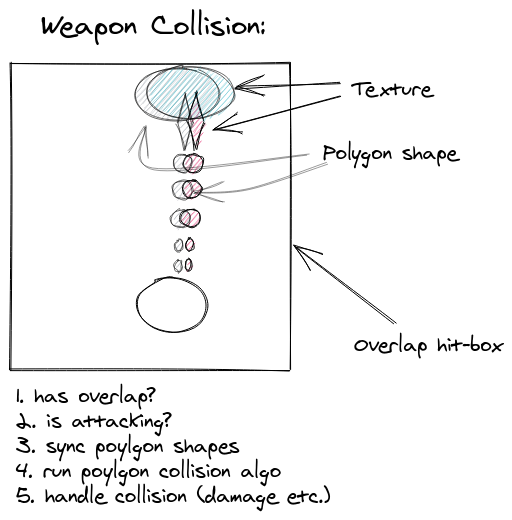
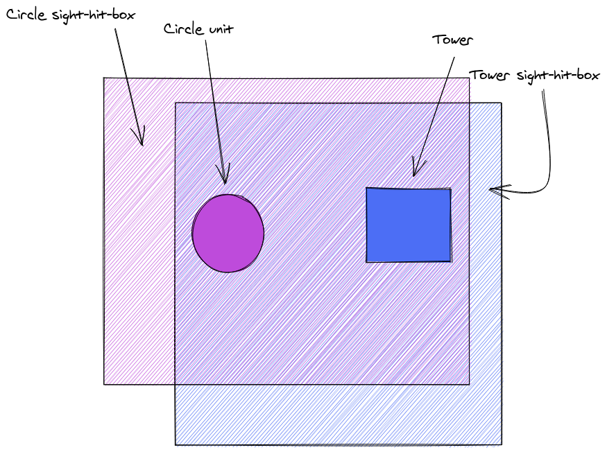
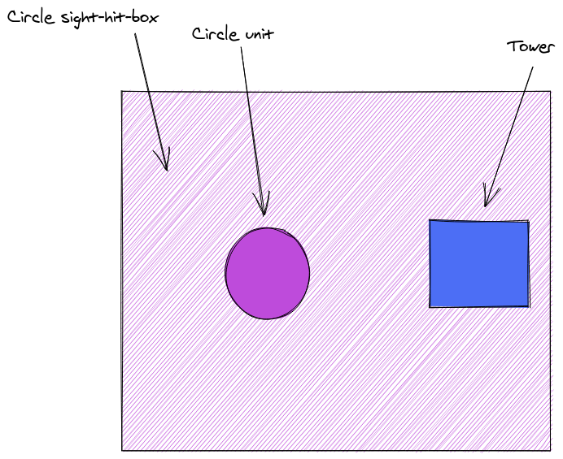
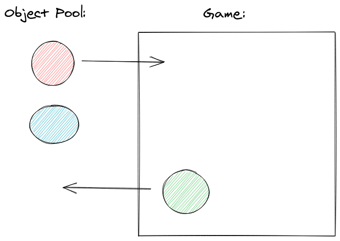
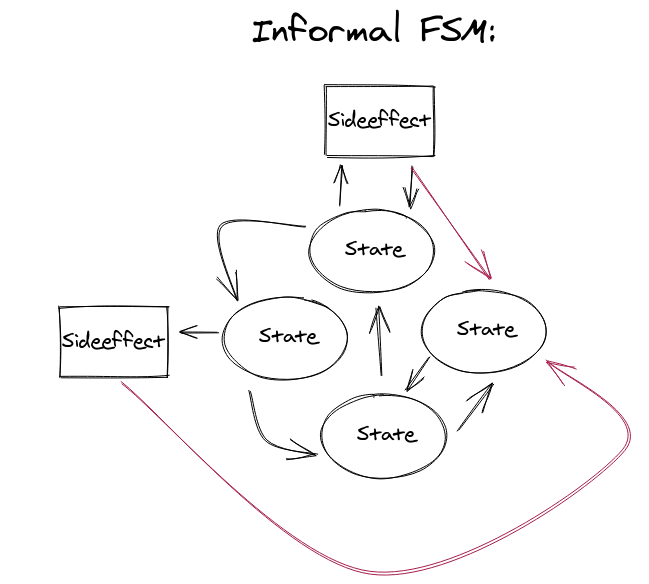
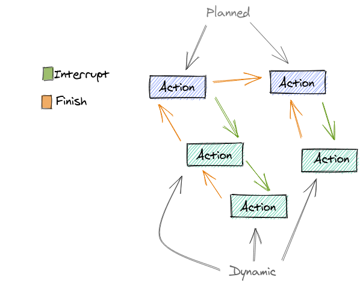
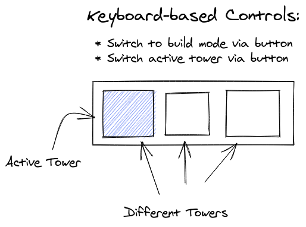

# Development History <!-- omit in toc -->

During the development of CGAA the differences between normal software development and game development became very apparent to me, so the development was a huge learning experience. \
This lead to me spending a lot of time on experimenting in and researching certain areas of the game, even if they would not all be visible to the player. \
The following is a recounting of what I did in these areas and more importantly what I learned there. \
In other words: \
The top 6 development time-sinks that might not be obvious from playing CGAA.

## Table of Contents <!-- omit in toc -->
- [1. Frameworks versus Engines](#1-frameworks-versus-engines)
- [2. Shapes, Graphics and Collision](#2-shapes-graphics-and-collision)
- [3. Performance Optimization](#3-performance-optimization)
- [4. AI: From FSM to Linked Lists](#4-ai-from-fsm-to-linked-lists)
- [5. Functional JavaScript to Object Oriented TypeScript](#5-functional-javascript-to-object-oriented-typescript)
- [6. UI: Modes to Clicks](#6-ui-modes-to-clicks)

## 1. Frameworks versus Engines

From the beginning of development, the concept of CGAA included a short playtime and a low barrier to entry. For this reason, it made sense to make it a browser game, because in this way everyone could play it. Phaser is one of the most used and well known frameworks to develop browser games with, so it was the natural choice. \
I wanted to use a framework and not an engine, because my goal was to spend most of my development time programming and not searching for options in an editor. A framework mostly tries to deliver buildings block while also giving structural guidance how the resulting software should be architected. An engine is more high level, as it usually includes editors and further developer tooling as well as a generally unified developer experience for game creation.

CGAA being my first real game, the proportions of the qualitative difference between frameworks and engines was unclear to me at the beginning of the development. Before choosing Phaser I made sure that it had examples, that there was documentation and that the community was still alive if I had questions. However, during development I discovered that besides the building blocks for games, Phaser really mostly offered loose suggestions how to structure your games (use scenes, use game objects etc.) and I had the feeling that I spent a lot of time re-inventing the wheel instead of building another bicycle. \
In the end I think Phaser is a mixed bag for first time game developers. It provides all the necessary building blocks, but upon intensive inspection the documentation is incomplete, there are no complex examples and without knowledge of game programming patterns, I was going in circles a lot of the time when it came to structuring the source code which lead to a lot of time spent refactoring.

## 2. Shapes, Graphics and Collision

In CGAA the most important shape is the circle. For this and other basics shapes like the rectangle, Phaser offers an API. Because the design of CGAA is minimal, it was natural to try to generate all graphics in-game. The workflow for this is to first draw a shape, then capture it and save it as a texture and then add the animation frames to the texture.


In the case of a circle texture, the frame-step would look like this:

```javascript
this.scene.textures.list[this.title].add(1, 0, 0, 0, 2 * this.radius, 2 * this.radius);
this.scene.textures.list[this.title].add(2, 0, 2 * this.radius, 0, 2 * this.radius, 2 * this.radius);
```

This approach was very convenient, because it mostly avoided needing to ship additional assets, input-ouput problems from graphic programs or pixel errors. The hard part was finding the correct APIs and hardcoding the basic measurements for the shapes without an immediate visual feedback. \
This worked fine for basic shapes and even for more complicated combined shapes like the chain-weapon I found a solution by reusing the polygon shapes that I implemented for collision detection.

For collision and overlap detection I used the most performant and simplest physics engine of Phaser: Arcade. The design of the game did not demand more complex physical operation, so this choice was obvious. \
However, the drawbacks where that only circles and rectangles were supported by Arcade and the chain-weapon consisted of a more complex shape: the arrow. To allow for this kind of collision detection I implemented polygon shapes and a separate collision detecion system, that would only be activated when a unit was attacking and then would synchronize the textures position (e.g. the weapon) with the corresponding polygon shape to calculate if a collision happend (in hindsight it might be more performant to approximate all the parts of the weapon separately with basic circles and rectangles). For the polygon based collision I tried out many different libaries (e.g. that used the Separating Axis Theorem) and due to huge differences in how the coordinates are interpreted, I setled for the one library that was compatible and wrote missing cases (e.g. collision of circle with circle) myself.



As the development progressed it became more and more tedious to hand-adjust the measurements of the shapes and complex shapes like the chain-weapon took nearly a week of fulltime work to get right, including the animations (this also had to do with Phasers weird interpretation of angles). \
It also became clear that trying to enhance the graphics (e.g. rounding the edges of towers to make them more distinct from walls) would not be feasible with this approach. \
At the end of the development I came to the conclusion that a more classical approach (e.g. using an extra graphics program) might have been better suited or a hybrid approach where the generation of graphics is a pre-processing step which allows to hand-adjust fine details.

## 3. Performance Optimization

Webpages are very performance sensitive, because the platform is inherently restricting how many resources can be used.
This means, that to implement even a comparatively simple game computation needs to be minimized. \
Early in development I already ran into bottlenecks when it came to physics calculation.
Analyzing the performance in the Chrome Developer Tools, one of the culprits turned out to be my line of sight mechanic, where the enemies can spot the player and other units if they are to close and attack them. The towers also had a line of sight mechanic but implementing these two different physics hitbox/area types lead to a huge drop in the framerate.



The solution was to use just one line of sight area in the moving units and to implement the tower line of sight in the loop that gets executed when other units are entering the area.



With this at least one third of line of sight areas could be reduced.
This improvement and many other smaller improvements (e.g. using arrays and sets instead of objects where possible, optimizing access and other types of algorithms in physics heavy hot paths), the framerate was stable in normal situations.

However, at certain points in the game, when new towers were build or new units spawned, I again noticed pretty severe framerate drops. This was the case because I was creating new objects and because of the way the JavaScript heap works, this lead to increased computation. I could solve this by using a concept from Game Programming Patterns, [the Object Pool](https://gameprogrammingpatterns.com/object-pool.html), where I created all the objects that I needed for the game at the start and held them in standby and then just reused the same objects again and again.



For this I need to implement my own Object Pools as the interface for the Phaser Object Pools were not suited to my already written code.
After fine tuning the amount of objects to create in the beginning and generally reducing the amount of objects/units used, I finally achieved a reasonable performance in every game state. Further improvement would probably require a new implementation of [my collision detection](#Shapes,-Graphics-and-Collision).

## 4. AI: From FSM to Linked Lists

When it comes to game AI a Finite State Machine is often used to implement complicated behavior.
In the case of CGAA this also was my first choice. However, after a while it became apparent that my informal approach to FSM (states include informal sideffects that can impact other states) lead to a few critical bugs (e.g. units running into walls leading to huge drops in framerate) and the complexity of my bug fixes became to much for my simple use case. So I could have re-implemented my FSM with a FSM framework to formalize all the cases or find a simpler solution.



I choose to re-think my AI and implement a simple system based on a kind of Linked List.



Inspired by [Naughty Dogs list-based Action-System](https://www.youtube.com/watch?v=gpINOFQ32o0), I abstracted my AI as an array of planned actions that a unit wants to fulfill. \
If one action is complete, it alerts the array holder and the next planned action is started. \
If the unit is interrupted during an action (e.g. the player is in attack range or the wave unit gets attacked before it reaches its destination), the action is made into a kind of linked list. A new dynamic action is created that deals with the interruption. This new action is linked to the interrupted action and is the new first entry in the “linked list” and once the new action is finished it notifies the old action and makes that action the first entry in the list again.

## 5. Functional JavaScript to Object Oriented TypeScript

When starting the development, I envisioned the randomized game map as a computation problem that would be suited to a functional approach.
It went through different phases that could be modeled as semi-pure functions that used the input of the respective previous functions. \
A simplified example:

- f() = Calculate middle points of Camps
- g() = Calculate wall positions of Camps
- h() = Calculate randomized building positions

By composing these functions I could then generate the Game Map. \
However, it became clear that partial or intermediate values from this composition where needed for other purposes. For example the exits of Camps, which are used to determine where not to place walls, where needed for path calculation and placing of the diplomat circles. \
Including these values in the outputs of the functions lead to huge Map Objects being passed around. \
When it became apparent that a few of the results would need to be accessed and changed by the Game Units (e.g. modifying the 0-1-representation of the Game Map), I converted most of the functions to objects and the results and partial results to fields on those objects.


I also converted the code base to Typescript as the amount of implicit types of objects was steadily growing and needed to be managed somehow. \
Making all the needed data available could have been achieved with a functional style, e.g. by decomposing the code into smaller functions. \
However, when looking at a minimal definition of object-orientation ([objects are fields and procedures, programs are interacting objects](https://en.wikipedia.org/wiki/Object-oriented_programming)) it became clear that this approach most closely mapped to my mental model of a real-time game (interacting units with changing state) and that is why I decided to shift my strategy.

In the end only the parts of the games computation remained functional, where it was easy to see that there was no dynamic change necessary. For example the initial programmatic generation of all textures or the creation of the animation frames.

## 6. UI: Modes to Clicks

3D games often switch between different modes of interaction via button press. For example drawing a weapon in an RPG means switching to attack mode and then switching between weapons. \
One of the influences for CGAA was "Orcs Must Die!" where the player can switch between Towers or Traps by using different keyboard buttons. Naturally the first controls for CGAA followed this schema.



After playtesting this with different groups of players (people with gaming experience to non-gamers), it was obvious that this was not going to work. While for me the different modes were obvious and I was able to use them to build towers very fast and interact with the diplomats, for my playtesters this was just confusing and most of them even did not figure out that you could interact with the diplomats at all. \
During my research I found out that Computer Scientists like [Larry Tesler](https://en.wikipedia.org/wiki/Larry_Tesler) already argued against using Modes in User Interfaces in the seventies because of the [known harmful effects](<https://en.wikipedia.org/wiki/Mode_(user_interface)#Mode_errors>) they can have. Tesler, who co-invented the modern understanding of copy-paste, argued that Click-based UI was the better alternative. \
When looking at mode based tools like vim, it seems that Modes might be appropriate mostly in systems that are used by experts and my game was certainly not intended to need expert knowledge to play it.

The literature on User Experience Design finally provided the hint, that the best User Interfaces fulfill the users expectations. In the case of CGAA, the main difference to Orcs Must Die! is that it is top-down and therefore the Tower Defense mechanics are not really similar. Top-down Tower Defense usually follows the UI of real-time strategy games (RTS) where you can click to build and click to select. RTS mostly works with what I call "selection bars" that pop up when a unit is selected and that provide further options to interact. This is in fact so intuitive that it does not need illustration because almost every popular wide-spreed Software works like this. \
Using this paradigm, I rebuilt the UI to feature clickable units and a clickable build menu. While the current UI is not perfect (mostly because I still have the switch between attack and interact mode - the mouse click is overloaded), it is a huge improvement on the purely mode based version.
